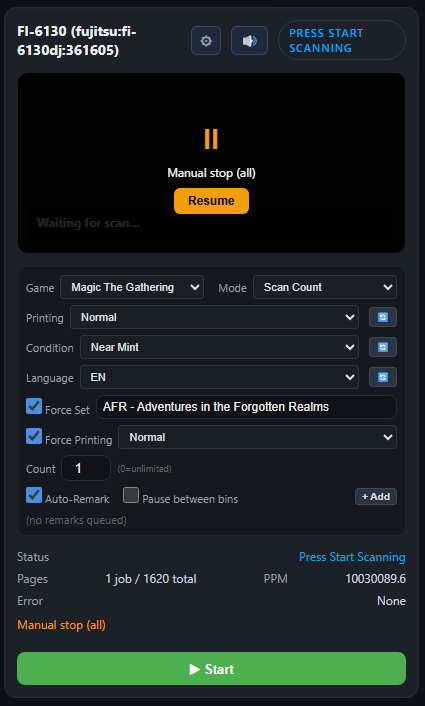

# Batch Scanning with SimpleSifter

SimpleSifter is the next step up from phone or webcam scanning, and is the most reliable way to scan directly into SortSwift from any Fujitsu or Ricoh compatible scanner.  While we recommend the Ricoh fi-8170 Scanner to take full advantage of Sortswift [(you can read more about our hardware recommendations here)](https://sortswift.com/features/hardware), many small-to-medium sized sellers can find value in SimpleSifter with smaller starting investments. 

SimpleSifter offers two ways to scan your cards into SortSwift:

1. **Stream scanning** - Enables scanning cards directly into the SwiftSort application

2. **Batch scanning** - Enables creation of "batches" of cards to import into SortSwift at a later time

This documentation will focus on batch scanning. [For more info on stream scanning, see the stream scanning documentation]()

*NOTE: To follow this documentation you will need to have SimpleSifter already started and running, which requires a fujitsu-compatible scanner and a Raspberry Pi.  [You can find our detailed setup documentation here.](https://scribehow.com/viewer/How_to_Install_and_use_the_Simple_Sifter__Ih_iNfYkTySnw453BZ4mdQ)*

## Step 1 - Prepare to Scan

### Manual Preparation

As a best-practice tip to help you make the most of SimpleSifter without sorting hardware, pre-sorted your cards by game, set, and finish.

Set and finish are not required...in fact SortSwift's AI does a pretty fantastic job of matching cards to specific sets and even detecting card finishes.  

However, if manually sorted before scanning, you can configure these constraints on your scanner settings in the SimpleSifter UI to (foil, etched foil, etc) to reduce or eliminate most of the manual intervention that might be required in cases where AI confidence might be low due to multiple finishes, printings, or other variations for a particular card

### Scanner Configuration

#### Mode
There are two scanning modes available:

1. **Scan Count** - Scans a specified number of cards before stopping 

*NOTE: You can set the "Count" value in the UI to "0" to have the scanner scan continually until there are no physical cards remaining, or you can set a different value to scan a specific number of cards at a time.*

2. **Scan til Stop** - Scans cards one at a time, pausing between each card and checking for highly customizable "stop conditions" (Like card names, values, sets, etc) before continuing.  If a configured stop condition is triggered, the scanning will not resume without manual intervention.

*NOTE: "Scan til Stop" pauses after every card scan before continuing while the AI checks for any configured stop conditions.  This makes this mode significantly slower than the "Scan Count" mode.*

In this documentation, we will scan normal-finish only cards from *Magic: The Gathering* set "AFR" in "Scan Count" mode with count "0" (continuous scan until user-initiated stop)

## Step 2 - Scanning Cards

#### Start Scanning
Click "Start" to begin scanning cards.  The scanner will consume the cards one at a time until:

1. The user manually stops/pauses scanning
2. The scanner cannot find a new card to scan (either a jam or out of cards)
3. The scan count, if set, is reached
4. A stop condition, if configured, is triggered

#### Checking the Scan Progress

As cards are being scanned, you can track the progress of the scanned cards by clicking on the most recent card image on the scanner settings.  This will open the scan history for the scanner, where you can see the AI detection progress of your scanned cards as well as information such as name, set, market prices, and more:

## Step 3 - Adding to a Batch

SimpleSifter allows for an in-progress batch to be either:
1. Saved to a new batch
2. Added to an existing batch
*NOTE: These batches are saved to the SimpleSifter (your Raspberry Pi) and NOT to SortSwift. We will cover moving these to SortSwift or exporting via CSV or XML in the next step*

#### Saving to a New Batch

## Step 4 - Importing the Batch into SortSwift